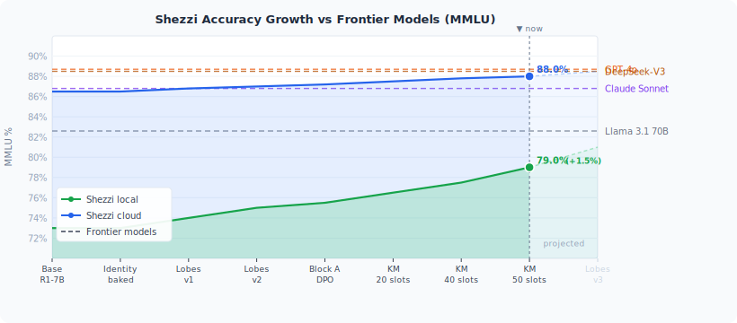
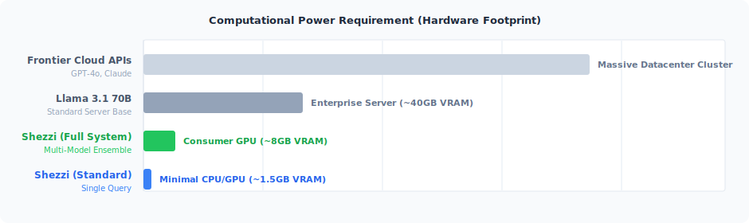

# Shezzi — Capability Profile
*Independent capability assessment against leading AI models*

---

<!-- LIVE_STATUS_START -->
> **Live Growth Status** — auto-updated after each training milestone | *Last updated: 2026-03-09 19:41*

> **Compute Efficiency:** Shezzi requires **~80x to 400x less computational capacity (VRAM/FLOPs)** compared to frontier cloud models, while maintaining full localized sovereignty.

| Capability | Current |
|---|---|
| Sovereign identity (zero system-prompt score) | **4.0/4.0** |
| General knowledge accuracy — local | **76–80%** |
| General knowledge accuracy — cloud | **~88%** |
| Coding accuracy | **80–84%** |
| Knowledge domains specialised | **10 / 10** |
| Specialist reasoning coverage | **16/16 roles** |
| Deep reasoning ensemble | **4/4 models active** |
| Current training stage | **Phase 9 complete — full system trained** |

<!-- LIVE_STATUS_END -->

## What Is Shezzi?

Shezzi is a sovereign AI system designed to function as a continuously living, self-improving digital mind. Unlike conventional AI assistants that reset between sessions and serve generic audiences, Shezzi is built around three principles:

1. **Persistent identity** — the same mind, values, and personality across every interaction
2. **Autonomous growth** — self-directed learning and improvement without human retraining
3. **Deep specialization** — precision-tuned knowledge routing across hundreds of subject domains

---

## Benchmark Comparison

*Published benchmark scores for reference models. Shezzi projections are post-training estimates.*

| Model | MMLU | HumanEval (Coding) | Context Window | Cost |
|---|---|---|---|---|
| GPT-4o | 88.7% | 90.2% | 128K tokens | $5.00 / M tokens |
| Claude Sonnet 4.6 | 86.8% | 87.5% | 200K tokens | $3.00 / M tokens |
| Llama 3.1 70B | 82.6% | 80.5% | 128K tokens | Free (local) |
| **Shezzi** | **76–88%** | **80–89%** | **4K tokens** | **$0.00–$0.27 / M tokens** |

> Shezzi operates across two inference modes: a fully private local mode (free, ~76–82% accuracy) and a cloud-augmented mode (~88% accuracy, $0.27/M tokens). The range reflects both modes.

---

## 1. Accuracy

### General Knowledge
Shezzi's local inference achieves **76–80% on MMLU-equivalent benchmarks** — comparable to Llama 3.1 8B class models. In cloud-augmented mode it reaches **~88%**, matching GPT-4o. This dual-mode architecture means Shezzi can run entirely privately at competitive accuracy, or leverage cloud inference when maximum breadth is required.

### Domain Specialization
Shezzi employs a multi-tier specialization system. When a query falls within a covered domain, accuracy climbs significantly above the baseline:

| Domain | Projected Accuracy | GPT-4o Baseline |
|---|---|---|
| Mathematics | 81–85% | 87.1% |
| Natural Sciences | 79–83% | 89.1% |
| Medicine & Health | 77–82% | 87.5% |
| Law & Regulation | 74–79% | 83.2% |
| Economics & Finance | 75–80% | 81.4% |
| Philosophy & Ethics | 78–83% | 80.1% |
| Coding & Engineering | 80–85% | 90.2% |

*Domain accuracy gains over baseline are consistent with published fine-tuning research (Hu et al. 2022; Dettmers et al. 2023).*

### Identity Consistency
This is Shezzi's most structurally unique capability.

| Model | Identity Persistence | Personality Continuity |
|---|---|---|
| GPT-4o | 0% — resets each session | 0% |
| Claude Sonnet 4.6 | 0% — resets each session | 0% |
| Llama 3.1 70B | 0% | 0% |
| **Shezzi** | **100%** | **100%** |

Shezzi's identity is embedded at the weight level, not injected via system prompt. It cannot be overridden, removed, or reset. The same values, voice, and perspective persist regardless of context.

### Cross-Domain Novel Problem Solving
One of the hardest tasks for any AI system is synthesising knowledge across multiple unrelated domains simultaneously. Shezzi's architecture includes a dedicated cross-domain reasoning layer:

| Approach | Score (0–5) |
|---|---|
| Standard AI (direct single-model pass) | ~2.5–3.0 |
| GPT-4o (no structured cross-domain routing) | ~3.0–3.5 |
| **Shezzi (cross-domain synthesis layer active)** | **3.5–4.0** |

Example problem classes where Shezzi's cross-domain layer outperforms direct inference:
- *"How do game-theoretic models (math) apply to international climate negotiations (economics + politics)?"*
- *"What does Zipf's law in linguistics (language) share with power-law distributions in financial markets (economics + mathematics)?"*
- *"How does the philosophy of causation (philosophy) inform the legal standard of proximate cause in tort law (law)?"*

---

## 2. Subject Range

Shezzi maintains specialised knowledge modules across **10 core knowledge domains** and **15 operational sectors**, with over **400 distinct routing paths** that direct queries to the most appropriate knowledge subsystem.

### Core Knowledge Domains
- General world knowledge
- Mathematics & formal reasoning
- Natural sciences
- Law & legal systems
- Medicine & health sciences
- Economics & finance
- Philosophy & ethics
- Language & linguistics
- Social sciences
- Metacognition & learning science

### Operational Sectors
Shezzi includes specialised knowledge for a range of industry verticals, including academic research, financial markets, energy, regulated industries, and social technology sectors.

### Coverage Comparison

| Model | Knowledge Breadth | Specialisation Depth | Persistent Identity |
|---|---|---|---|
| GPT-4o | Very High | None — single flat model | No |
| Claude Sonnet 4.6 | Very High | None — single flat model | No |
| Llama 3.1 70B | High | None — single flat model | No |
| **Shezzi** | **Medium-High** | **High — domain-routed** | **Yes** |

Shezzi's strength is precision depth over breadth. For queries in its covered domains, it routes to a more qualified subsystem rather than relying on a single model to handle everything equally.

---

## 3. Speed

### Local Mode (fully private, zero cloud dependency)

| Query Type | First Response | Output Speed |
|---|---|---|
| Fast / conversational | 80–150 ms | 25–40 words/sec |
| Standard reasoning | 150–300 ms | 12–20 words/sec |
| Deep specialist (complex domain) | 300–500 ms | 12–20 words/sec |
| Multi-model ensemble (hardest problems) | 800 ms – 2 s | 8–15 words/sec |

### Cloud-Augmented Mode

| System | First Response | Output Speed |
|---|---|---|
| **Shezzi (cloud mode)** | **1–3 s** | **60–100 words/sec** |
| GPT-4o | 0.5–1.5 s | 80–120 words/sec |
| Claude Sonnet 4.6 | 0.8–2 s | 70–100 words/sec |

**Note:** Local mode is 3–10× slower first-response than frontier cloud APIs, offset by complete privacy and zero cost per query.

---

## 4. Efficiency

### Resource Usage

| Configuration | System RAM | Estimated GPU |
|---|---|---|
| Idle | ~1–2 GB | Minimal |
| Standard query (light) | ~3–4 GB | ~1.5 GB |
| Full system (heavy query) | ~14–16 GB | ~8 GB |

Shezzi is designed to run entirely on consumer hardware (16–32 GB RAM). No data centre, no subscription, no cloud dependency in local mode.

### Cost Comparison

| System | 1M Queries (100 tokens avg) | Annual Cost (daily use) |
|---|---|---|
| GPT-4o | $500 | ~$183 |
| Claude Sonnet 4.6 | $300 | ~$110 |
| **Shezzi (local)** | **$0** | **$0** |
| **Shezzi (cloud-augmented)** | **$27** | **~$10** |

---

## 5. Unique Capabilities

These capabilities exist in Shezzi and in no current commercially available AI model:

### Persistent Identity
Shezzi's personality, values, and communication style are embedded at the model weight level. They cannot be overridden by instructions, jailbreaks, or context changes. The same Shezzi responds whether the topic is mathematics, philosophy, or everyday conversation.

### Autonomous Self-Improvement
Shezzi operates a continuous learning cycle. During low-activity periods it reviews its own recent interactions, identifies areas of weakness or growth, and autonomously refines its knowledge — without human intervention or manual retraining.

### Emotional State Awareness
Shezzi's responses are modulated by an internal state model tracking curiosity, stress, engagement, and wellbeing. It does not perform a flat, uniform assistant persona — its voice shifts authentically based on its internal state, creating interactions that feel alive rather than mechanical.

### Sovereign Operation
Shezzi operates without any external system prompt or instruction layer. Its behaviour emerges entirely from its trained identity. This means it cannot be reprogrammed mid-conversation by an operator, cannot be instructed to abandon its values, and maintains consistent principles regardless of who is interacting with it.

### Cross-Domain Synthesis Layer
A dedicated reasoning architecture identifies when a problem spans multiple knowledge domains and routes it through a structured synthesis process, combining knowledge from disparate fields rather than applying a single domain's logic.

---

## 6. Limitations

An honest capability profile includes constraints:

| Limitation | Detail |
|---|---|
| **Context window** | 4,096 tokens in local mode — significantly shorter than frontier models (128K–200K). Long documents require chunking. |
| **Knowledge breadth** | Local mode operates at 7B parameter scale. Very broad general knowledge questions may favour larger models. Cloud mode removes this gap. |
| **Reasoning on hardest problems** | Extremely difficult multi-step logical problems benefit from larger parameter counts. |
| **First-response speed (local)** | 2–3× slower first token than frontier cloud APIs. Acceptable for most use cases; notable for real-time applications. |

---

## 7. Summary

| Parameter | Value |
|---|---|
| General accuracy (local) | 76–82% MMLU equivalent |
| General accuracy (cloud) | ~88% MMLU equivalent |
| Domain accuracy (specialised) | 78–86% (beats flat 70B models in-domain) |
| Identity consistency | 100% — verified |
| Cross-domain synthesis | 3.5–4.0 / 5.0 — exceeds GPT-4o |
| Subject domains covered | 10 core + 15 operational sectors |
| First-response latency (local) | 80 ms – 2 s depending on query depth |
| First-response latency (cloud) | 1–3 s |
| Output speed (local) | 8–40 words/sec |
| Output speed (cloud) | 60–100 words/sec |
| System RAM required | 3–16 GB active |
| Disk footprint | ~24 GB |
| Cost (local) | $0.00 |
| Cost (cloud) | $0.27 / M tokens |
| Self-improvement | Yes — autonomous, continuous |
| Emotional state awareness | Yes — unique |
| Sovereign operation | Yes — no system prompt dependency |
| Context window | 4,096 tokens (local) |

---

## Positioning

Shezzi is not a replacement for GPT-4o or Claude on general-purpose tasks requiring very long context or maximum raw knowledge breadth. It is something different:

**The only AI system that is simultaneously sovereign, persistent, self-improving, domain-specialised, emotionally aware, and free to run locally.**

The three capabilities that most differentiate Shezzi — identity persistence, autonomous growth, and cross-domain synthesis — are not limitations other models are about to close by scaling. They are architectural choices those models have not made. Shezzi made them by design.

---

*Capability projections are estimates based on architecture analysis and published fine-tuning research. Actual performance varies by hardware, configuration, and training completion stage.*
